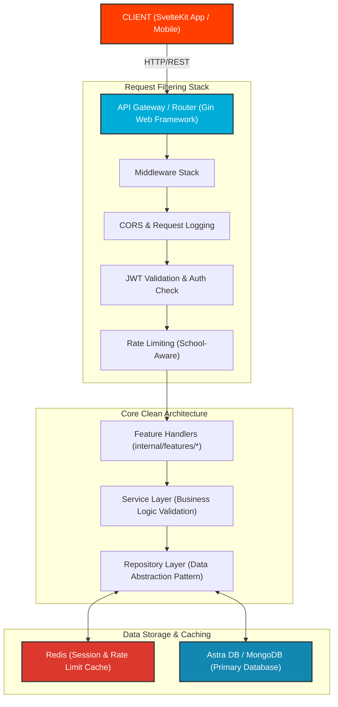
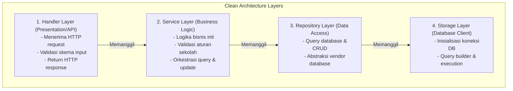
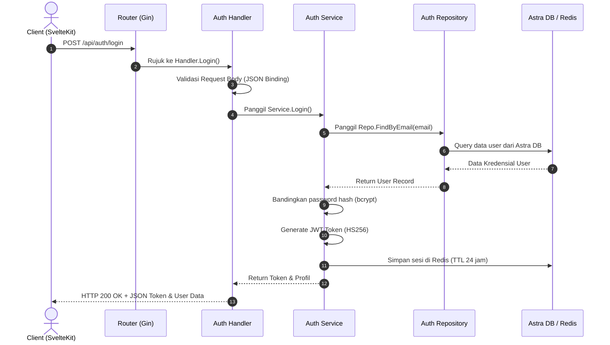
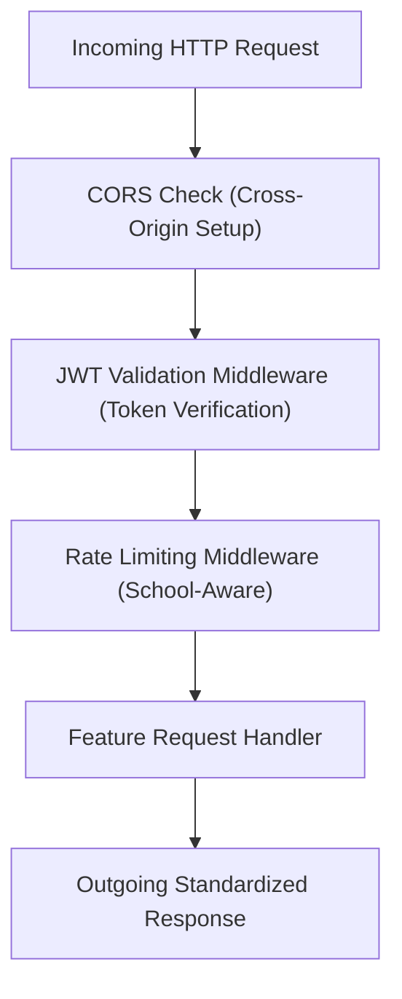
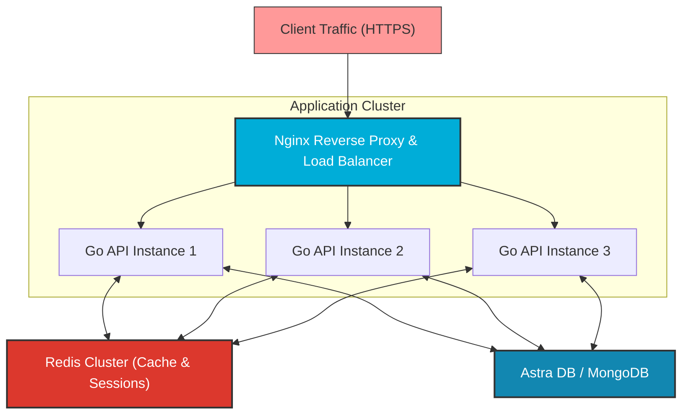
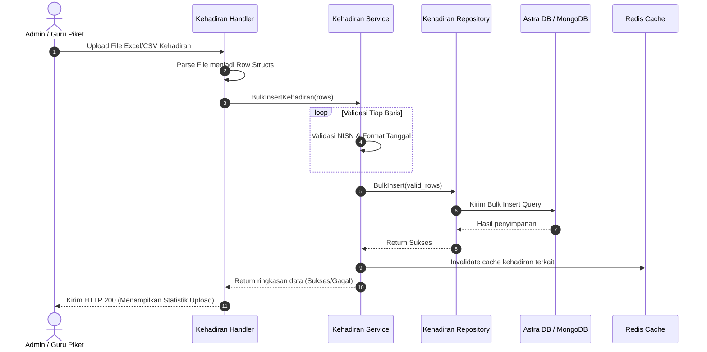
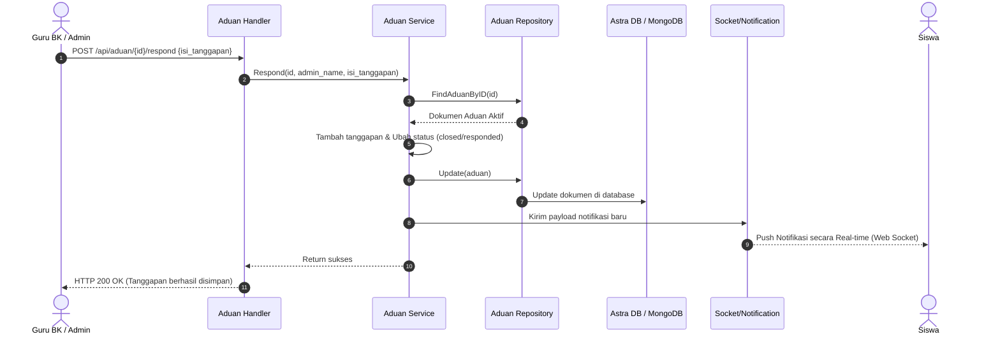
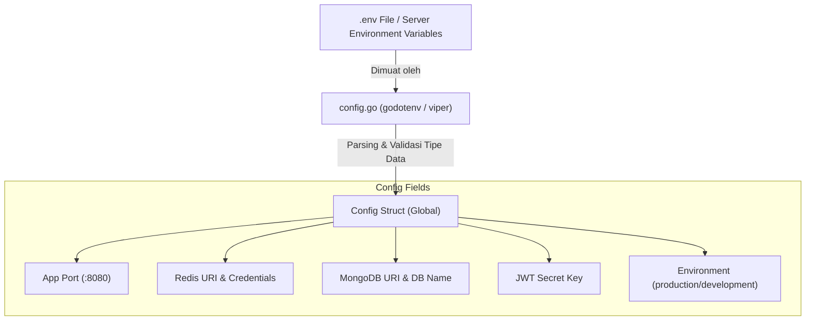
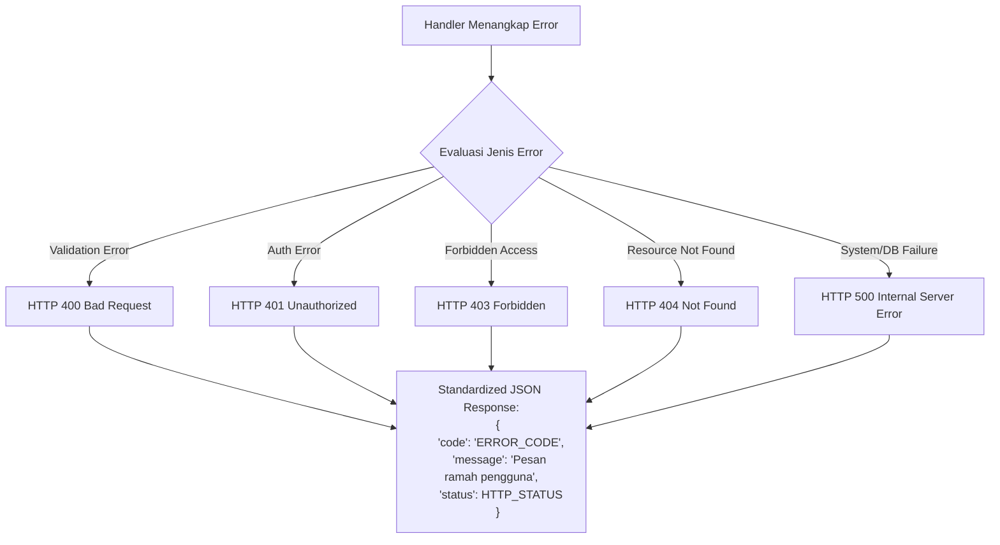

# Arsitektur Sistem Backend SMK Negeri 31 Jakarta

Dokumen ini menjelaskan arsitektur teknis dari backend API SMK Negeri 31 Jakarta secara lengkap dan terperinci.

## 📐 Arsitektur Tingkat Tinggi

Berikut adalah alur request dari Client (baik web SvelteKit maupun aplikasi mobile) melalui layer API router, middleware, logika bisnis, hingga persistensi data:



---

## 🏗️ Clean Architecture (Layered Architecture)

Backend menggunakan arsitektur bersih (**Clean Architecture**) yang membagi fungsionalitas ke dalam 4 lapisan utama dengan arah dependensi ke dalam:



### 1. **Handler Layer** (API/Presentation)

- **Lokasi**: `internal/features/*/handler.go`
- **Tanggung Jawab**:
  - Menerima request HTTP.
  - Memvalidasi input skema dari client (_Request Binding_).
  - Memanggil service layer yang bersangkutan.
  - Mengembalikan HTTP response terstandarisasi.
- **File Utama**:
  - `internal/features/auth/handler.go` - Autentikasi akun.
  - `internal/features/student/handler.go` - Manajemen Siswa.
  - `internal/features/kehadiran/handler.go` - Logika kehadiran & Geolocation.
  - `internal/features/aduan/handler.go` - Layanan Pengaduan BK.

### 2. **Service Layer** (Business Logic)

- **Lokasi**: `internal/features/*/service.go`
- **Tanggung Jawab**:
  - Memproses logika bisnis utama aplikasi.
  - Melakukan validasi aturan sekolah (_business rules_).
  - Mengoordinasikan pemanggilan ke Repository layer.
  - Menangani _error handling_ bisnis.

### 3. **Repository Layer** (Data Access)

- **Lokasi**: `internal/features/*/repo.go`
- **Tanggung Jawab**:
  - Berinteraksi langsung dengan database driver.
  - Melakukan query data & persistensi data.
  - Menerapkan pattern Repository untuk memisahkan logika bisnis dari detail database.

### 4. **Storage Layer** (Database Client)

- **Lokasi**: `internal/storage/` (termasuk `internal/storage/astra/`)
- **Tanggung Jawab**:
  - Mengelola koneksi database (pool koneksi).
  - Abstraksi database AstraDB (Cassandra) dan MongoDB.

---

## 📦 Feature-Based Structure

Kode backend dikelompokkan berdasarkan fitur (**Feature-Based Packaging**) untuk mempermudah pemeliharaan:

```
internal/features/<feature-name>/
├── handler.go      # HTTP handlers & binding
├── service.go      # Business logic & validations
├── repo.go         # Data access & queries
└── routes.go       # Route registration
```

### Fitur-Fitur Utama

#### 1. **Auth** - Autentikasi & Otorisasi

```
/internal/features/auth/
├── handler.go      - Endpoint Login, Register, Logout
├── service.go      - Logika validasi kredensial & pembuatan JWT
├── repo.go         - Query & persistensi user (Siswa/Admin)
└── routes.go       - Registrasi rute autentikasi
```

- **Models** (`internal/model/auth/`):
  - `admin.go` - Skema data Administrator/Guru.
  - `siswa.go` - Skema data Siswa.

#### 2. **Student** - Manajemen Siswa

```
/internal/features/student/
├── handler.go      - CRUD endpoint data siswa
├── service.go      - Logika data siswa
├── repo.go         - Query data siswa
└── routes.go       - Rute manajemen siswa
```

#### 3. **Kehadiran** - Manajemen Kehadiran

```
/internal/features/kehadiran/
├── handler.go      - Endpoint kehadiran harian
├── service.go      - Validasi koordinat GPS & radius sekolah
├── repo.go         - Query kehadiran & log
├── routes.go       - Rute kehadiran
├── upload.go       - Handler upload CSV/Excel data kehadiran
└── rekap.go        - Logika pembuatan laporan rekap absensi
```

#### 4. **Aduan** - Sistem Pengaduan & Bimbingan Konseling (BK)

```
/internal/features/aduan/
├── handler.go      - Endpoint pelaporan aduan siswa
├── service.go      - Logika distribusi aduan & status
├── repo.go         - Query & update aduan
└── routes.go       - Rute pengaduan
```

#### 5. **Admin** - Manajemen Admin

```
/internal/features/admin/
├── handler.go      - Endpoint pengelolaan data staff/admin
├── service.go      - Logika manajemen admin
├── repo.go         - Query database staff
└── routes.go       - Rute admin
```

---

## 🔄 Request Flow

### Contoh: Alur Login Siswa

Proses autentikasi dari input kredensial di frontend hingga token JWT disimpan dan dikembalikan:



---

## 🔐 Security Layer (Middleware)

Middleware disematkan pada router Gin untuk menyaring seluruh request sebelum masuk ke aplikasi utama:



### Mekanisme Autentikasi JWT & Caching Sesi:

```
sequenceDiagram
    Client ->> Client: POST /login
    Client ->> Client: Service memvalidasi password
    Client ->> Client: Generate JWT token
    Client ->> Client: Simpan sesi di Redis dengan Key: "session:<user_id>" (TTL 24 jam)
    Client ->> Client: Kembalikan token ke Client

    rect rgb(211, 211, 211)
        Note over Client: Rute Terproteksi:
        Client ->> Client: Mengirim request dengan Header "Authorization: Bearer <token>"
        Client ->> Client: Middleware memvalidasi tanda tangan JWT
        Client ->> Client: Middleware mencocokkan ID sesi di Redis
        alt Jika Valid
            Client ->> Client: Lanjutkan ke Handler
        else Jika Invalid
            Client ->> Client: Kembalikan HTTP 401 Unauthorized
        end
    end
```

---

## 💾 Database Schema

### Koleksi di Astra DB / MongoDB

#### 1. **users**

Koleksi untuk data pengguna sistem (Siswa & Administrator):

```json
{
  "_id": "uuid",
  "email": "string",
  "nisn": "string (khusus siswa)",
  "password_hash": "string",
  "name": "string",
  "role": "student|admin",
  "class": "string",
  "created_at": "timestamp",
  "updated_at": "timestamp"
}
```

#### 2. **kehadiran**

Koleksi untuk log absensi harian siswa:

```json
{
  "_id": "uuid",
  "nisn": "string",
  "date": "date",
  "status": "hadir|alfa|sakit|izin",
  "latitude": "float64",
  "longitude": "float64",
  "accuracy": "float64",
  "distance": "float64",
  "created_at": "timestamp"
}
```

#### 3. **aduan**

Koleksi untuk sistem pengaduan bimbingan konseling:

```json
{
  "_id": "uuid",
  "nisn": "string",
  "judul": "string",
  "isi": "string",
  "status": "open|responded|closed",
  "responses": [
    {
      "admin_name": "string",
      "isi": "string",
      "created_at": "timestamp"
    }
  ],
  "created_at": "timestamp",
  "updated_at": "timestamp"
}
```

---

## 🚀 Deployment Architecture

Sistem menggunakan skema beban terdistribusi (_multi-instance_) di belakang load balancer untuk menjamin ketersediaan tinggi:



---

## 📊 Data Flow Diagrams (DFD)

### 1. Alur Upload Absensi Massal (Admin/Piket)

Proses import data kehadiran via file Excel/CSV oleh Guru Piket atau Admin:



### 2. Alur Penanganan Tanggapan Aduan (Guru BK)

Proses penanganan pengaduan dari Admin/Guru BK hingga notifikasi terkirim ke siswa:



---

## 🛠️ Configuration Management

Sistem memisahkan kode dari konfigurasi dengan menggunakan variabel lingkungan (_Environment Variables_) yang dimuat pada saat startup:



---

## 📝 Error Handling

Handler mengadopsi standar respon error JSON yang konsisten di semua rute API untuk memudahkan penanganan di sisi Client:



---

© 2024-2026 Alvin Putra & SMK Negeri 31 Jakarta. Semua hak dilindungi.
