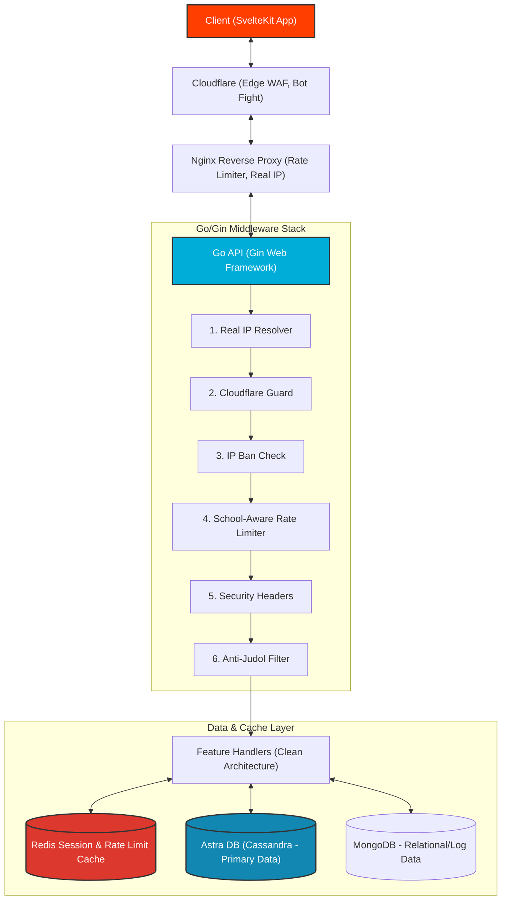
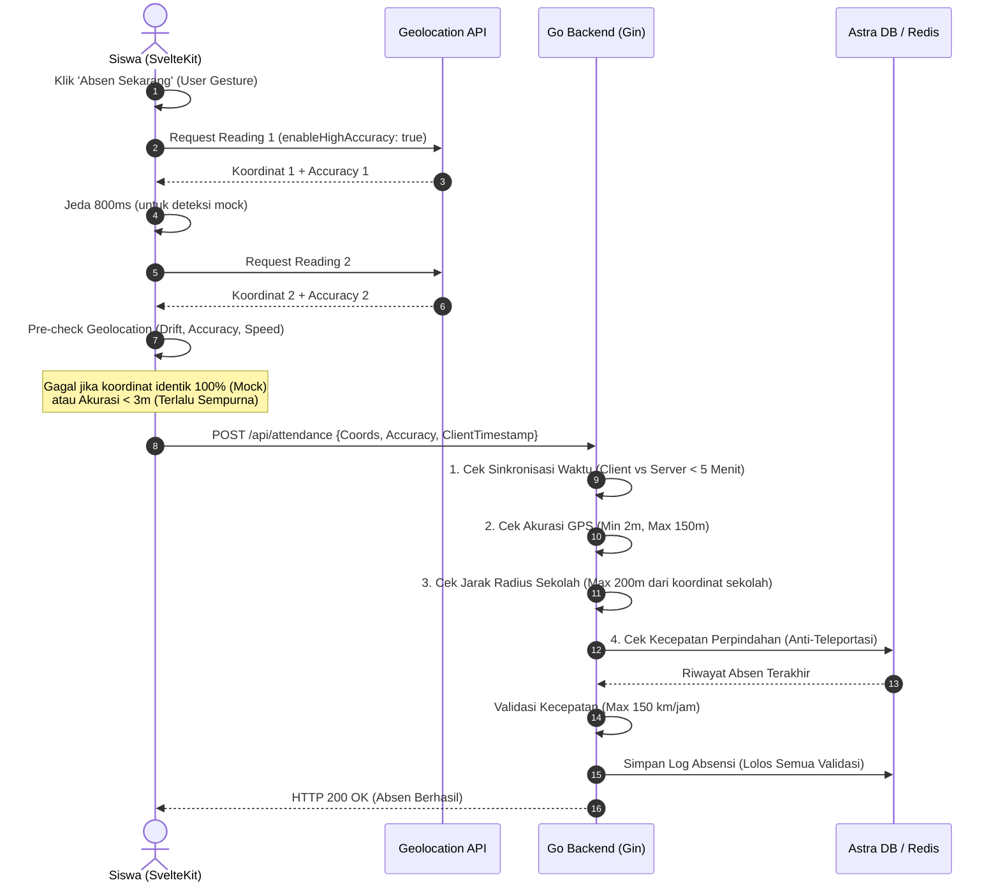

<p align="center">
  
</p>

# 🏫 Sistem Informasi Absensi & Pengaduan SMK Negeri 31 Jakarta

[](https://golang.org)
[](https://kit.svelte.dev)
[](https://tailwindcss.com)
[](https://astra.datastax.com)
[](https://supabase.com)
[](https://turso.tech)
[](https://mongodb.com)
[](https://redis.io)
[](https://cloudflare.com)


Sistem Informasi Terintegrasi SMK Negeri 31 Jakarta adalah platform berbasis web modern yang dirancang untuk mengelola **Absensi Geolocation (Anti-Fake GPS)**, **Sistem Pengaduan Siswa**, **Pelaporan Kegiatan (G7KAIH)**, serta **Dashboard Pemantauan Kehadiran** bagi Admin, Guru Bimbingan Konseling (BK), Guru Piket, dan Siswa.

Platform ini dibangun menggunakan arsitektur **Clean Architecture (Go + Gin)** di sisi backend dan **Reactive SPA/SSR (SvelteKit + TypeScript + TailwindCSS)** di sisi frontend, menjamin kinerja tinggi, skalabilitas, serta keamanan tingkat tinggi terhadap serangan siber (DDoS & Bot).

---

## 📐 Arsitektur Sistem Tingkat Tinggi

Berikut adalah visualisasi alur request dari Client hingga ke Layer Database melalui mekanisme proteksi Cloudflare, Nginx, dan Go Middleware:



---

## ✨ Fitur-Fitur Utama

### 1. 📍 Absensi Pintar dengan Anti-Fake GPS & iOS Fix

Sistem absensi dilengkapi dengan validasi berlapis di sisi Client (Frontend) dan Server (Backend) untuk mendeteksi penggunaan Fake GPS / Mock Location secara akurat tanpa memicu _false positive_ pada perangkat iOS (Safari):

- **Dual Geolocation Reading (Frontend):** Melakukan pengambilan koordinat ganda dengan interval 800ms untuk mendeteksi micro-drift (jika koordinat identik 100%, terindikasi Fake GPS).
- **Validasi Akurasi (Client & Server):** Memblokir koordinat dengan akurasi terlalu sempurna (< 2m, khas emulator/mocking) atau terlalu buruk (> 150m, sinyal lemah).
- **Geofencing Radius Sekolah:** Membatasi absensi hanya dalam radius maksimal 200 meter dari koordinat SMK Negeri 31 Jakarta.
- **Anti-Teleportasi (Server-Side):** Menghitung kecepatan perpindahan lokasi dari absensi terakhir. Jika kecepatan perpindahan melebihi 150 km/jam, absensi otomatis ditolak.
- **Sinkronisasi Waktu:** Mencegah manipulasi waktu perangkat lokal oleh siswa (maksimal perbedaan waktu client dan server adalah 5 menit).



### 2. 🛡️ Keamanan Berlapis (Defense in Depth & Anti-DDoS)

Sistem dikeraskan secara ketat di seluruh layer infrastruktur untuk menampung traffic padat (_burst traffic_) saat jam sibuk absensi (~700 siswa dalam waktu bersamaan) sekaligus menahan serangan DDoS:

- **Layer 1 (Cloudflare Edge WAF):** Mengaktifkan Bot Fight Mode, Browser Integrity Check, enkripsi TLS 1.3, SSL Strict, serta pemblokiran bypass hostname (akses IP VPS langsung).
- **Layer 2 (UFW Firewall VPS):** Konfigurasi firewall lokal VPS agar _hanya menerima koneksi port 80/443 dari alamat IP resmi Cloudflare_. Seluruh traffic bypass langsung di-drop.
- **Layer 3 (Nginx Reverse Proxy):** Konfigurasi _Real IP restoration_ dari Cloudflare, pembatasan body size request (maksimal 5MB), dan pembagian zona limitasi request (`limit_req_zone` & `limit_conn_zone`).
- **Layer 4 (School-Aware Rate Limiter - Go):** Rate limiting berbasis Redis yang dinamis mengikuti jadwal sekolah (WIB):
  - **Peak Hour (Jam Sibuk Absensi):** Batasan dilonggarkan (hingga 30 req/menit per IP) untuk memastikan siswa tidak terblokir saat absen serempak.
  - **Normal Hour:** Batasan diperketat untuk menghemat sumber daya server.
  - **Auto-Ban:** Jika request dari suatu IP melebihi ambang batas yang wajar (flood), sistem secara otomatis mem-ban IP tersebut selama 6 jam di Redis.
- **Anti-Judol Filter:** Filter keamanan tambahan untuk memblokir aktivitas mencurigakan terkait eksploitasi konten ilegal/judi online.

```mermaid
graph LR
    Attacker["Attacker / Bot / Client"] -->|HTTPS Request| CF["Cloudflare Edge"]

    subgraph "Cloudflare Layer"
        CF --> CFWAF{"WAF Custom Rules & Bot Fight"}
        CFWAF -->|Match Spam/Bot| CFBlock["Block / Managed Challenge"]
        CFWAF -->|Legitimate Traffic| CFIP["CF IPs Proxied"]
    end

    CFIP -->|UFW Only Allows CF IPs| VPSUFW{"UFW Firewall (VPS)"}
    VPSUFW -->|Non-CF Traffic| UFWDrop["Drop Packet"]
    VPSUFW -->|CF Traffic| Nginx["Nginx Reverse Proxy"]

    subgraph "VPS Server"
        Nginx --> NginxRL{"Rate Limiting (limit_req & limit_conn)"}
        NginxRL -->|Rate Exceeded| Nginx429["HTTP 429 / Drop"]
        NginxRL -->|Pass| GoGin["Go/Gin Web Application"]
    end

    subgraph "Application Layer"
        GoGin --> SchoolRL{"School-Aware Rate Limiter"}
        SchoolRL -->|Flood Detected| AutoBan["Auto-Ban IP (6 Hours)"]
        SchoolRL -->|Pass| Process["Process Request"]
    end

    style Attacker fill:#f99,stroke:#333,stroke-width:1px
    style CFBlock fill:#f66,stroke:#333,stroke-width:1px,color:#fff
    style UFWDrop fill:#f66,stroke:#333,stroke-width:1px,color:#fff
    style Nginx429 fill:#f66,stroke:#333,stroke-width:1px,color:#fff
    style AutoBan fill:#f66,stroke:#333,stroke-width:1px,color:#fff
    style Process fill:#9f9,stroke:#333,stroke-width:2px
```



### 3. 💬 Layanan Pengaduan & Bimbingan Konseling (BK)

- Siswa dapat membuat laporan pengaduan/konseling terkait fasilitas sekolah, perundungan, maupun masalah akademik secara langsung lewat sistem.
- Dashboard khusus Guru BK dan Guru Piket untuk menanggapi pengaduan dengan status terstruktur (_Open_, _Responded_, _Closed_).
- Dilengkapi dengan fitur obrolan (Chat) terintegrasi untuk komunikasi interaktif.

### 4. 📅 Kalender Kegiatan & Upload Bukti (G7KAIH)

Sistem memfasilitasi pelaporan program **Gerakan 7 Karakter Anak Indonesia Hebat (G7KAIH)**. Siswa dapat mencatatkan aktivitas harian mereka secara berkala beserta bukti pendukung yang relevan.

#### 7 Pilar Aktivitas G7KAIH:
| Aktivitas | Icon | Deskripsi |
| :--- | :---: | :--- |
| **Bangun Tidur** |  | Pencatatan jam bangun tidur siswa untuk melatih kedisiplinan pagi hari. |
| **Beribadah** |  | Laporan ibadah harian sesuai agama masing-masing siswa. |
| **Makan Sehat** |  | Pemantauan pola makan teratur dan bergizi seimbang. |
| **Belajar** |  | Pelaporan jam belajar mandiri atau penyelesaian tugas di luar jam sekolah. |
| **Berolahraga** |  | Pencatatan aktivitas fisik/olahraga untuk menjaga kebugaran jasmani. |
| **Berorganisasi** |  | Pelaporan keikutsertaan dalam kegiatan organisasi atau kepanitiaan. |
| **Tidur Tepat Waktu** |  | Istirahat yang cukup dengan mencatat jam tidur malam yang disiplin. |

---

## 🛠️ Struktur Repositori

Proyek ini menggunakan struktur monorepo terpisah untuk Backend dan Frontend:

```
smk31/
├── be-gr31/                 # BACKEND (Go + Gin Web Framework)
│   ├── cmd/
│   │   └── http/            # Entry point HTTP server (main.go)
│   ├── internal/
│   │   ├── config/          # Manajemen konfigurasi (.env loader)
│   │   ├── features/        # Layered architecture per modul (Clean Architecture)
│   │   │   ├── auth/        # Modul Autentikasi (JWT, Password hashing)
│   │   │   ├── student/     # Modul Siswa (CRUD & manajemen profil)
│   │   │   ├── kehadiran/   # Modul Absensi (Upload excel/CSV & geo validation)
│   │   │   ├── aduan/       # Modul Pengaduan / BK
│   │   │   └── admin/       # Modul Administrasi Utama
│   │   ├── middleware/      # Keamanan, Rate Limiter, Real IP Resolver
│   │   ├── model/           # Definisi skema database (AstraDB & MongoDB)
│   │   ├── router/          # Registrasi rute Gin Web Framework
│   │   └── storage/         # Adapter database (AstraDB Cassandra & MongoDB)
│   ├── Dockerfile           # Konfigurasi container backend
│   └── docker-compose.yml   # Orkestrasi local service (MongoDB, Redis, dsb)
│
├── fe-gr31/                 # FRONTEND (SvelteKit + Svelte 5 + TailwindCSS)
│   ├── src/
│   │   ├── api/             # Integrasi HTTP Client & API Call
│   │   ├── lib/             # Komponen reusable & utilitas umum
│   │   │   └── utils/
│   │   │       └── geoValidation.ts # Validasi lokasi multi-reading anti-mock
│   │   ├── routes/          # SvelteKit routing (File-based)
│   │   │   ├── admin/       # Dashboard administrator utama
│   │   │   ├── bk/          # Dashboard Guru Bimbingan Konseling (BK)
│   │   │   ├── piket/       # Dashboard Guru Piket
│   │   │   ├── siswa/       # Halaman utama & panel portal siswa
│   │   │   └── login/       # Form masuk (Multi-role authentication)
│   │   └── stores/          # State management (Svelte writable stores)
│   ├── package.json         # Dependensi frontend & script lifecycle
│   └── svelte.config.js     # Konfigurasi SvelteKit
│
├── ARCHITECTURE.md          # Penjelasan detail arsitektur backend
└── README.md                # Dokumentasi utama proyek (Dokumen ini)
```

---

## 🚀 Memulai (Getting Started)

### Prasyarat System

Sebelum menjalankan proyek, pastikan Anda telah memasang:

- **Go 1.21+**
- **Node.js v18+** / **Bun v1.0+**
- **MongoDB** & **Redis** (dapat dijalankan via Docker)

---

### Langkah 1: Menjalankan Backend (`be-gr31`)

1. Pindah ke direktori backend:

   ```bash
   cd be-gr31
   ```

2. Salin template environment variables dan sesuaikan konfigurasinya:

   ```bash
   cp .env.example .env
   ```

   _Atur kredensial MongoDB, Redis, JWT Secret, serta koordinat sekolah pada `.env`._

3. Jalankan service pendukung (Redis & MongoDB) menggunakan Docker Compose (Opsional):

   ```bash
   docker-compose up -d
   ```

4. Unduh dependensi Go:

   ```bash
   go mod download
   ```

5. Jalankan backend server:
   ```bash
   go run main.go
   # atau
   go run cmd/http/main.go
   ```
   _API server akan berjalan secara default pada port `8080`._

---

### Langkah 2: Menjalankan Frontend (`fe-gr31`)

1. Pindah ke direktori frontend:

   ```bash
   cd ../fe-gr31
   ```

2. Pasang dependensi menggunakan package manager pilihan Anda (direkomendasikan `bun` untuk performa maksimal):

   ```bash
   bun install
   # atau
   npm install
   ```

3. Jalankan development server:

   ```bash
   bun run dev -- --open
   # atau
   npm run dev
   ```

   _Buka browser pada alamat `http://localhost:5173`._

4. Untuk membuat build production:
   ```bash
   bun run build
   # untuk preview hasil build
   bun run preview
   ```

---

## 📊 Matriks Status Pesan Geolocation & Error Handling

Untuk memastikan kenyamanan pengguna (_user experience_) di perangkat mobile, seluruh penanganan error dirancang ramah pengguna dan terperinci:

| Kondisi GPS              | Pesan yang Ditampilkan ke Siswa                                          | Kode Error               | Aksi yang Diperlukan                                                               |
| :----------------------- | :----------------------------------------------------------------------- | :----------------------- | :--------------------------------------------------------------------------------- |
| **Akurasi < 2m**         | ⚠️ GPS accuracy mencurigakan. Matikan aplikasi mock location.            | `SUSPICIOUS_ACCURACY`    | Nonaktifkan Fake GPS / Mock Location di opsi Developer perangkat.                  |
| **Akurasi > 150m**       | ⚠️ Sinyal GPS terlalu lemah. Pindah ke area terbuka dan coba lagi.       | `WEAK_SIGNAL`            | Cari area luar ruangan (_outdoor_) untuk mendapatkan lock satelit GPS yang stabil. |
| **Koordinat Identik**    | ⚠️ Lokasi GPS tidak bergerak. Matikan aplikasi fake GPS.                 | `STATIC_MOCK`            | Perangkat terdeteksi menggunakan fake GPS statis. Matikan emulator/mocking.        |
| **Luar Radius (> 200m)** | ⚠️ Kamu berada X meter dari sekolah. Absensi hanya bisa di area sekolah. | `OUT_OF_RANGE`           | Siswa harus berada di area fisik lingkungan sekolah untuk melakukan absensi.       |
| **Akses Lokasi Ditolak** | ⚠️ Izinkan akses lokasi di pengaturan browser untuk absen.               | `PERMISSION_DENIED`      | Berikan izin geolocation di browser (Chrome / Safari) untuk situs ini.             |
| **Kecepatan > 150 km/j** | ⚠️ Lokasi absensi tidak wajar. Hubungi admin jika ini kesalahan.         | `TELEPORTATION_DETECTED` | Terjadi perpindahan lokasi tidak wajar dari lokasi absensi sebelumnya.             |
| **Waktu Tidak Sinkron**  | ⚠️ Waktu perangkat tidak sinkron. Pastikan waktu HP sudah benar.         | `TIME_OUT_OF_SYNC`       | Ubah pengaturan waktu HP menjadi "Otomatis (Sinkron dengan Jaringan)".             |

---

## 🔒 Konfigurasi Produksi & Keamanan VPS (Nginx + UFW)

Saat melakukan deployment pada Hostinger VPS, pastikan untuk menerapkan konfigurasi berikut:

1. **Jalankan script update IP Cloudflare secara berkala** (bisa ditambahkan ke cronjob mingguan) agar UFW hanya menerima request melalui proxy Cloudflare:

   ```bash
   sudo chmod +x /usr/local/bin/update-cf-ips.sh
   sudo crontab -e
   # Tambahkan baris berikut untuk update setiap hari Minggu jam 02.00 pagi:
   0 2 * * 0 /usr/local/bin/update-cf-ips.sh >> /var/log/gr31-cf-update.log 2>&1
   ```

2. **Gunakan header Nginx yang tepat** untuk meneruskan alamat IP asli pengguna ke backend Go:
   ```nginx
   proxy_set_header X-Real-IP $remote_addr;
   proxy_set_header X-Forwarded-For $proxy_add_x_forwarded_for;
   proxy_set_header CF-Connecting-IP $http_cf_connecting_ip;
   ```

---

© 2024-2026 SMK Negeri 31 Jakarta & Tim Pengembang GR31. Hak Cipta Dilindungi Undang-Undang.
